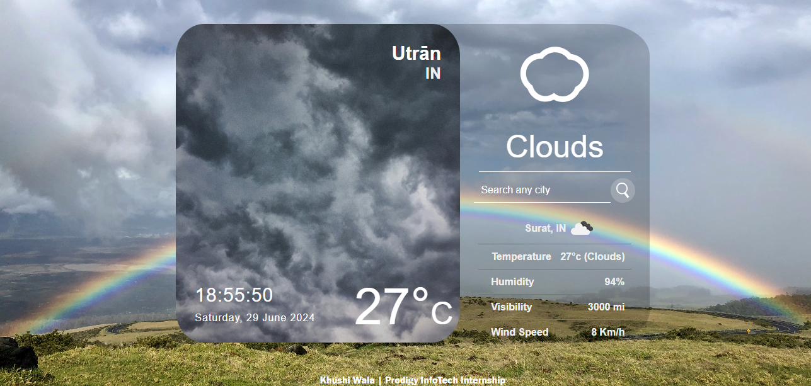
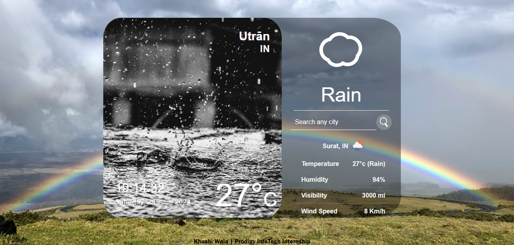
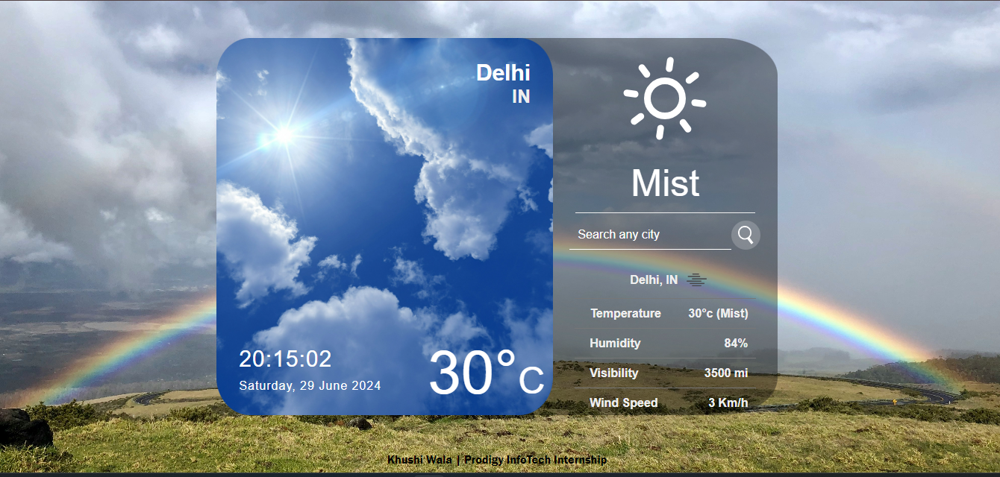
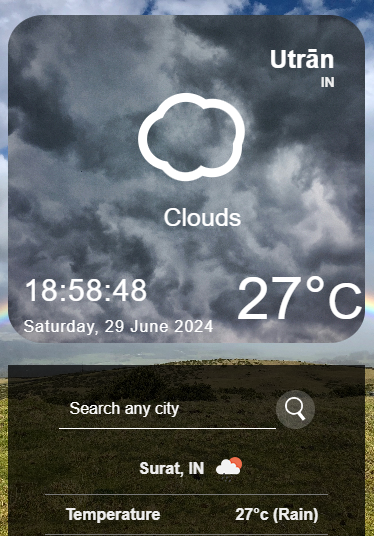
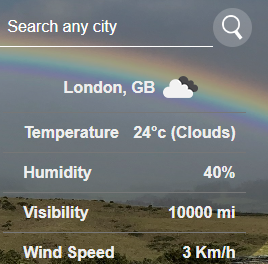
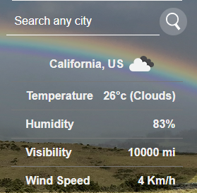
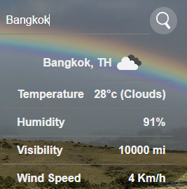
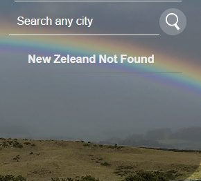
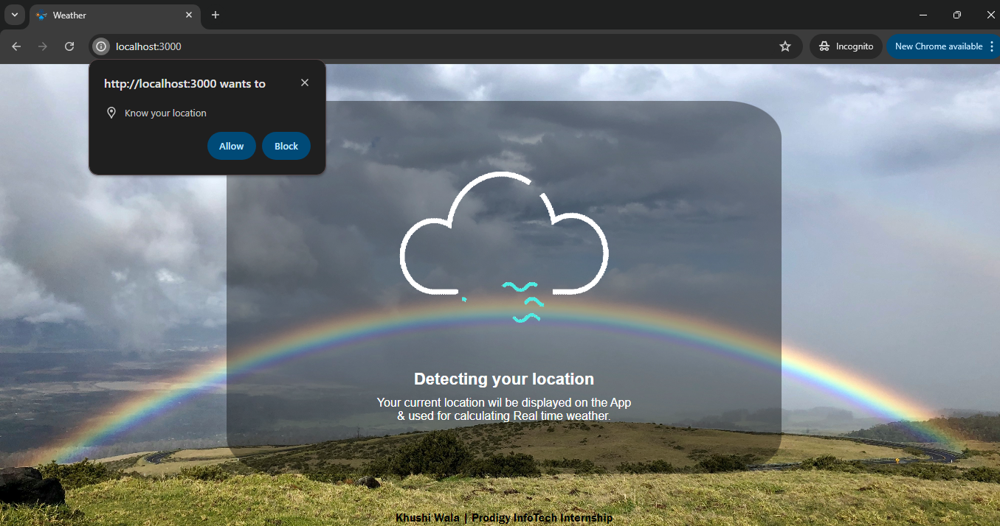

<!DOCTYPE html>
<html lang="en">
<body>
  <h1> Weather Forcast </h1>
  
This project based on Task-03 Weather application  by Prodigy InfoTech Internship.
    This project built using React FrameWork and <b>OpenWeathermap API</b>.
 

  
  <h2>Features</h2>
  <ul>
      <li>React Framwork for structure building & different Libraries like axions,react-live-clock,react-animated-weather,etc</li>  
      <li>Uses OpenWeather Api for Current weather Information </li>
      <li>Loader Event for Allow or Not Allow Loacation Acess</li>
      <li>Search Different City Weather condition</li>
      <li>Feature like location,County,Current Date,Time and Temperature.</li>
 </ul>
 

  <h2>Preview Images</h2>

  
Here are previews of Weather Application and Features :

  <figure>
    <figcaption><b>Desktop View with different weather</b></figcaption>
    
    
  </figure>
  
  <figure>
      <figcaption><b>Mobile View</b></figcaption>
    
  </figure>

  <figure>
      <figcaption><b>Search Feature</b></figcaption>
    
    
  </figure>

   <figure>
      <figcaption><b>Loader Location & allow alert</b></figcaption>
    
  </figure>

  

  <i><b>
Happy coding!
</b></i>
</body>
</html>

